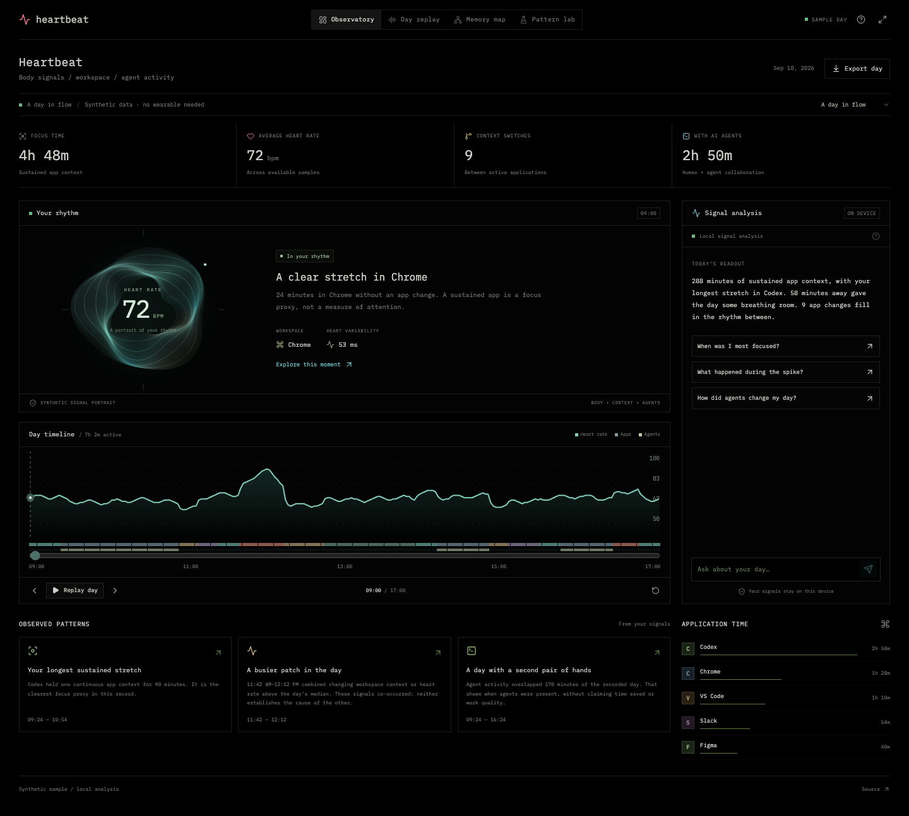

# Heartbeat · Rhythm and memory

New rhythm, timeline, and memory features for the existing Heartbeat desktop app. Built with Astra at the OpenAI hackathon. This repository shares the reusable components and a browser preview.

Explore the relationship between body signals, workspace activity, and AI collaboration through a living signal portrait, a replayable day, and an interactive memory constellation.

[Try the observatory](https://kllymx.github.io/heartbeat-astra/) · [Demo walkthrough](docs/DEMO.md) · [Project assessment](docs/ASSESSMENT.md) · [Model setup](docs/MODEL.md)



## Run locally

Requires Node.js 22.18+ (Node 24 recommended).

```sh
npm ci
npm run dev
```

Open http://127.0.0.1:5186. No account, API key, wearable, or native app is needed for the sample experience.

## Explore

- **Observatory.** A generative signal portrait, duration-weighted metrics, day timeline, contextual observations, and an evidence-backed question panel.
- **Day replay.** Play, pause, and scrub through synchronized heart rate, app context, agent activity, and automatically derived chapters. Space toggles replay; arrow keys step through time.
- **Memory map.** Explore a searchable constellation of applications, contexts, and agent sessions. Select a node to inspect its measurements and jump to its moment in the day.
- **Pattern lab.** Compare three deliberately constructed days: flow, context overload, and recovery. Every metric is computed from its scenario's timeline.
- **Portable summary.** Export a JSON report of aggregate measurements and observations without raw screen captures.
- **Optional connected intelligence.** A local server can call the OpenAI Responses API with your configured model. Credentials stay server-side; the UI requires opt-in before sending a question and sanitized aggregate context.

## Honest modes

The standalone browser app contains **synthetic sample data**. The default **local signal analysis** is a deterministic engine, not a language model. “Built with Astra” describes the coding workflow. It does not imply that the offline demo runs Astra inference.

For real model answers, follow [MODEL.md](docs/MODEL.md). Set a model identifier available to your account; no public Astra API identifier is assumed. The static GitHub Pages demo does not include a model server.

The desktop integration uses `RhythmPanel` directly inside the existing Heartbeat overview, with the original toolbar, timeline, and local collector. It reads the host's real dashboard and collector state; it never loads demo fixtures. The memory map opens from the original toolbar and can seek the original timeline. See [Desktop integration](docs/DESKTOP.md). The separate `native.ts` adapter is available for embedding the full browser preview in a Tauri shell. This public repository does not ship the private native collector or a packaged desktop app.

The graphs describe co-occurrence, not causation. Focus is a behavioral proxy, and recovery refers to an observed pause or lower-activity interval. These are reflection tools, not medical measurements or diagnoses.

## Architecture

```text
src/astra/
  Observatory.tsx        Application shell, scenarios, Q&A, exports
  RhythmPanel.tsx        Original desktop overview integration
  SignalOrb.tsx          Animated SVG signal portrait
  ReplayChart.tsx        Synchronized physiological / app / agent timeline
  MemoryConstellation.tsx  Searchable context graph and inspector
  engine.ts              Pure, duration-weighted observational analysis
  demo.ts                Reproducible fictional day scenarios
  model.ts               Optional model-server client
  native.ts              Optional Tauri telemetry adapter
server/
  astra.mjs              Local-only OpenAI API proxy
```

React 19 · TypeScript · Vite · SVG · Node.js. No database or hosted backend is required for the sample experience.

## Validation

```sh
npm test
npm run lint
npm run build
# Optional browser checks:
npx playwright install chromium
npm run test:e2e
```

CI runs these checks on pushes and pull requests. GitHub Pages publishes the static app from the `main` branch via GitHub Actions.

## Provenance and license

MIT licensed; see [LICENSE](LICENSE). Bundled DM Sans and IBM Plex Mono fonts retain their SIL Open Font License files under `src/astra/fonts/`. This repository contains the new observatory experience and the minimum original frontend contracts needed to integrate it. It deliberately excludes the original private repository's history, screenshots, telemetry stores, credentials, native collectors, and vendored WHOOP implementation. That vendored implementation carried a personal-use / unlicensed notice and has not been relicensed here.
